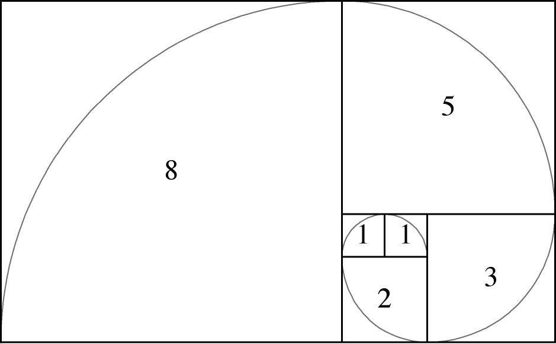
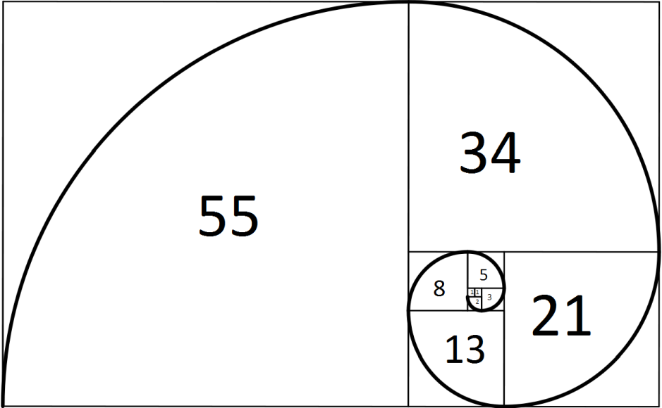

(Sec:SeqAndTypes)=
# Sequences and their types

## Introduction

Consider the following five numbers:

::::{math}
:label: Eq:SeqAndTypes:PositiveIntegersFiniteList
1,2,3,4,5.
::::

As you can see, these numbers are ordered, and even contain a pattern: each number is one more than the previous one. We could continue this pattern indefinitely by adding $1$ to the last number to obtain the next number. This gives us the infinite list of numbers

::::{math}
:label: Eq:SeqAndTypes:PositiveIntegersList
1,2,3,4,5,6,7,8,9,10,\ldots.
::::

Now consider the next five numbers:

::::{math}
:label: Eq:SeqAndTypes:ReciprocalPerfectSquaresFiniteList
1,\frac{1}{4},\frac{1}{9},\frac{1}{16},\frac{1}{25}.
::::

[^perfect-squares]: A perfect square is a square of a positive integer.

Each number is the reciprocal of a perfect square[^perfect-squares]. We can continue this pattern indefinitely by taking the reciprocal of the next perfect square to obtain the next number. This gives us the infinite list of numbers

::::{math}
:label: Eq:SeqAndTypes:ReciprocalPerfectSquaresList
1,\frac{1}{4},\frac{1}{9},\frac{1}{16},\frac{1}{25},\frac{1}{36},\frac{1}{49},\frac{1}{64},\frac{1}{81},\frac{1}{100},\ldots.
::::

The lists in Equations {eq}`Eq:SeqAndTypes:PositiveIntegersFiniteList`, {eq}`Eq:SeqAndTypes:PositiveIntegersList`, {eq}`Eq:SeqAndTypes:ReciprocalPerfectSquaresFiniteList` and {eq}`Eq:SeqAndTypes:ReciprocalPerfectSquaresList` are _all_ examples of **sequences**. In the next sections we will give a precise definition of what sequences are, how you can represent them, and we will give some types of common sequences. We end with showing some famous sequences. 

## Sequences

We start of with the definition of sequences and some relevant terminology.[^extensionCh1]

[^extensionCh1]: The content of this section is an extension of the content of {numref}`Sec:SumsAndProducts:FiniteSequences`.

::::::{prf:definition}
:label: Def:SeqAndTypes:Definition

A **sequence** is an ordered list of numbers arranged in a specific order.

Each number in a sequence is called a **term** of the sequence.

The position of a term in a sequence is called the **index** of the term. The value of the index depends on the position of the term in the sequence and the choice of the **starting index**. The **ending index** is the index of the last term of the sequence, if it exists. If there is no last term, then we say that the sequence is **infinite**, otherwise we say that the sequence is **finite**.
::::::

Note that a sequence does not have to be defined by a pattern. Also, the starting index can be any integer, but it is often convenient to start with $1$ or $0$.

There are several ways to represent a sequence:

::::{prf:notation}
:label: Not:SeqAndTypes:SequenceNotation

The following are all different notations for the same _finite_ sequence:

- $\displaystyle\{a_n\}_{n=p}^{q}$.
- $\displaystyle a_p,a_{p+1},a_{p+2},\ldots,a_q$.

In this case $p$ is the starting index and $q$ is the ending index.

The following are all different notations for the same _infinite_ sequence:

- $\displaystyle\{a_n\}_{n=p}^{\infty}$.
- $\displaystyle a_p,a_{p+1},a_{p+2},\ldots$

$p$ is again the starting index, but there is no ending index since the sequence is infinite.

The choice for the letter $a$ is arbitrary, and we can use any letter to denote the terms of the sequence. The letter $n$ is often used to denote the index, but we can also use any other letter for the index.

Sometimes we just write $\{a_n\}$ to denote a sequence, so if we do, please be aware that the context is relevant in that case.

::::

:::{prf:remark}
:label: Rmk:SeqAndTypes

In this book we nearly never consider _finite_ sequences, so if we use the term _sequence_, we often mean an _infinite_ sequence.
:::

In many cases the terms of an sequence are defined by an explicit formula for the general term in terms of the index:

::::{prf:definition}
:label: Def:SeqAndTypes:ExplicitFormula

An **explicit formula for a sequence** $\{a_n\}$ is a formula that gives the $n$th term $a_n$ of the sequence directly in terms of the index $n$ for all integers $n$ larger than the starting index.
::::

::::{prf:example}
:label: Ex:SeqAndTypes:PositiveIntegersExplicitFormula
The sequence of positive integers $1,2,3,4,5,\ldots$ of Equation {eq}`Eq:SeqAndTypes:PositiveIntegersList` can be defined by the explicit formula

$$
a_n=n\quad\text{for}\quad n=1,2,3,\ldots
$$

Note that it makes sense to start with $n=1$ since the first term of the sequence is $1$. We could also have started with $n=0$ and define $a_n=n+1$ for $n=0,1,2,\ldots$, but this seems unnecessary.
::::

::::{prf:example}
:label: Ex:SeqAndTypes:ReciprocalPerfectSquaresExplicitFormula
The sequence of reciprocals of perfect squares $1,\frac{1}{4},\frac{1}{9},\frac{1}{16},\frac{1}{25},\ldots$ of Equation {eq}`Eq:SeqAndTypes:ReciprocalPerfectSquaresList` can be defined by the explicit formula

$$
a_n=\frac{1}{n^2}\quad\text{for}\quad n=1,2,3,\ldots
$$
::::

::::{prf:example}
:label: Ex:SeqAndTypes:ExplicitFormula

Now consider the sequence $\{a_n\}_{n=1}^{\infty}$ with $a_n=\dfrac{n}{n^2+1}$ for $n=1,2,3,\ldots$.

This means, by substituting $n=1$ in the explicit formula, that the first term of the sequence is

$$
a_1=\frac{1}{2},
$$

by substituting $n=2$ that the second term of the sequence is

$$
a_2=\frac{2}{5},
$$

by substituting $n=3$ that the third term of the sequence is

$$
a_3=\frac{3}{10},
$$

and so on. We could write the sequence out as

$$
\{a_n\}_{n=1}^{\infty} = \frac{1}{2},\frac{2}{5},\frac{3}{10},\frac{4}{17},\frac{5}{26},\ldots
$$

::::

In other cases, or even the same, the terms of a sequence are not expressed with an explicit formula, but with a recursive formula:

::::{prf:definition}
:label: Def:SeqAndTypes:RecursiveFormula

A **recursive formula for a sequence** $\{a_n\}_{n=p}^{\infty}$ is a formula that gives the $n$th term $a_n$ of the sequence in terms of $k$ of the preceding terms for all integers $n>p+k$ in combination with formulas for the first $k$ terms $a_p,a_{p+1},\ldots,a_{p+k}$ of the sequence.

::::

::::{prf:example}
:label: Ex:SeqAndTypes:PositiveIntegersRecursiveFormula
The sequence of positive integers $1,2,3,4,5,\ldots$ of Equation {eq}`Eq:SeqAndTypes:PositiveIntegersList` can be defined by the recursive formula

$$
a_1=1,\quad a_{n+1}=a_n+1\quad\text{for}\quad n=1,2,3,\ldots
$$

::::

::::{prf:example} 
:label: Ex:SeqAndTypes:RecursiveFormula

The sequence $\{a_n\}_{n=0}^{\infty}$ defined by $a_{n+1}=-\dfrac12a_n$ with $n=0,1,2,\ldots$ and $a_0=1$ can be written out as:

$$
\{a_n\}_{n=0}^{\infty} = 1,-\frac{1}{2},\frac{1}{4},-\frac{1}{8},\frac{1}{16},-\frac{1}{32},\ldots
$$

::::

(Sec:SeqAndTypes:Types)=
## Types of common sequences

We start with an easy type of sequence, which is the arithmetic sequence.

::::::{prf:definition}
:label: Def:SeqAndTypes:ArithmeticSequence
A sequence is called an **arithmetic sequence** if the difference between two consecutive terms is always the same. This difference is called the **common difference**. 
::::::

::::::{prf:theorem}
:label: Thm:SeqAndTypes:ArithmeticSequence
Let $\{a_n\}_{n=p}^{\infty}$ be an arithmetic sequence with common difference $d$ and initial term $a_p=b$.

Then the sequence can be defined by the *explicit formula*

$$
a_n=b+(n-1)d\quad\text{for}\quad n=p,p+1,p+2,\ldots.
$$

It can also be defined by the *recursive formula* $a_p=b$ and

$$
a_{n+1}=a_n+d\quad\text{for}\quad n=p,p+1,p+2,\ldots.
$$

::::::

::::::{prf:example}
:label: Ex:SeqAndTypes:ArithmeticSequencePositiveIntegers

The sequence of positive integers $1,2,3,4,5,\ldots$ is an arithmetic sequence with common difference $1$ and first term $1$.

The explicit formula is

$$
a_n=1+(n-1)\cdot1\quad\text{for}\quad n=1,2,3,\ldots
$$

and the recursive formula is $a_1=1$ and

$$
a_{n+1}=a_n+1\quad\text{for}\quad n=1,2,3,\ldots.
$$

::::::

::::::{prf:example}
:label: Ex:SeqAndTypes:ArithmeticSequencePositive

The sequence $1,3,5,7,9,\ldots$ is an arithmetic sequence with common difference $2$ and first term $1$.

The explicit formula is

$$
a_n=1+(n-1)\cdot2=2n-1\quad\text{for}\quad n=1,2,3,\ldots
$$

and the recursive formula is $a_1=1$ and

$$
a_{n+1}=a_n+2\quad\text{for}\quad n=1,2,3,\ldots.
$$

::::::

::::::{prf:example}
:label: Ex:SeqAndTypes:ArithmeticSequenceNegative

The sequence $3,1,-1,-3,-5,\ldots$ is an arithmetic sequence with common difference $-2$ and first term $3$.

The explicit formula is

$$
a_n=3+(n-1)\cdot(-2)=5-2n\quad\text{for}\quad n=1,2,3,\ldots
$$

and the recursive formula is $a_1=3$ and
$$
a_{n+1}=a_n-2\quad\text{for}\quad n=1,2,3,\ldots.
$$

::::::

Next up are the harmonic sequences.

::::::{prf:definition}
:label: Def:Sequences:HarmonicSequence
A sequence is called a **harmonic sequence** if the reciprocals of its terms form an arithmetic sequence. 
::::::

::::::{prf:example}
:label: Ex:SeqAndTypes:HarmonicSequence1

The sequence $1,\frac{1}{2},\frac{1}{3},\frac{1}{4},\frac{1}{5},\ldots$ is a harmonic sequence, because the reciprocals of its terms $1,2,3,4,5,\ldots$ form an arithmetic sequence with common difference $1$ and first term $1$.

The explicit formula is

$$
a_n=\frac{1}{n}\quad\text{for}\quad n=1,2,3,\ldots
$$

and the recursive formula is $a_1=1$ and

$$
a_{n+1}=\frac{1}{\frac{1}{a_n}+1}\quad\text{for}\quad n=1,2,3,\ldots.
$$

::::::

::::::{prf:example}
:label: Ex:SeqAndTypes:HarmonicSequence2

The sequence $1,\frac{1}{3},\frac{1}{5},\frac{1}{7},\frac{1}{9},\ldots$ is a harmonic sequence, because the reciprocals of its terms $1,3,5,7,9,\ldots$ form an arithmetic sequence with common difference $2$ and first term $1$.

The explicit formula is

$$
a_n=\frac{1}{2n-1}\quad\text{for}\quad n=1,2,3,\ldots
$$

and the recursive formula is $a_1=1$ and

$$
a_{n+1}=\frac{1}{\frac{1}{a_n}+2}\quad\text{for}\quad n=1,2,3,\ldots.
$$

::::::

::::{prf:example}
:label: Ex:SeqAndTypes:HarmonicSequence3

The sequence $\frac{1}{3},1,-1,-\frac{1}{3},-\frac{1}{5},\ldots$ is a harmonic sequence, because the reciprocals of its terms $3,1,-1,-3,-5,\ldots$ form an arithmetic sequence with common difference $-2$ and first term $3$.

The explicit formula is

$$
a_n=\frac{1}{5-2n}\quad\text{for}\quad n=1,2,3,\ldots
$$

and the recursive formula is $a_1=\frac{1}{3}$ and

$$
a_{n+1}=\frac{1}{\frac{1}{a_n}-2}\quad\text{for}\quad n=1,2,3,\ldots.
$$
::::

The geometric sequences are also very common.

::::::{prf:definition}
:label: Def:SeqAndTypes:GeometricSequence
A sequence is called a **geometric sequence** if each term, except for the first one, is obtained by multiplying the previous term by a fixed nonzero number, called the **common ratio**. 
::::::

::::::{prf:theorem}
:label: Thm:SeqAndTypes:GeometricSequence

Let $\{a_n\}_{n=p}^{\infty}$ be a geometric sequence with common ratio $r$ and initial term $a_p=b$.

Then it can be defined by the *explicit formula* $a_n=br^{n-p}$ for $n=p,p+1,p+2,\ldots$.

It can also be defined by the *recursive formula* $a_p=b$ and $a_{n+1}=ra_n$ for $n=p,p+1,p+2,\ldots$.
::::::

::::::{prf:example}
:label: Ex:SeqAndTypes:GeometricSequence1

The sequence $1,2,4,8,16,\ldots$ is a geometric sequence with common ratio $2$, with explicit formula

$$
a_n=2^{n-1}\quad\text{for}\quad n=1,2,3,\ldots
$$

and recursive formula $a_1=1$ and

$$
a_{n+1}=2a_n\quad\text{for}\quad n=1,2,3,\ldots.
$$
::::::

::::::{prf:example}
:label: Ex:SeqAndTypes:GeometricSequence2

The sequence $1,\frac{1}{2},\frac{1}{4},\frac{1}{8},\frac{1}{16},\ldots$ is a geometric sequence with common ratio $\frac{1}{2}$, with explicit formula

$$
a_n=\frac{1}{2^{n-1}}\quad\text{for}\quad n=1,2,3,\ldots
$$

and recursive formula $a_1=1$ and

$$
a_{n+1}=\frac{1}{2}a_n\quad\text{for}\quad n=1,2,3,\ldots.
$$

::::::

::::::{prf:example}
:label: Ex:SeqAndTypes:GeometricSequence3

The sequence $-1,1,-1,1,-1,\ldots$ is a geometric sequence with common ratio $-1$, explicit formula

$$
a_n = (-1)^{n-1}\quad\text{for}\quad n=1,2,3,\ldots
$$

and recursive formula $a_1=-1$ and

$$
a_{n+1}=-1\cdot a_n\quad\text{for}\quad n=1,2,3,\ldots.
$$

::::::

The last example is a nice example of an alternating sequence:

::::::{prf:definition}
:label: Def:Sequences:AlternatingSequence
A sequence is called an **alternating sequence** if two consecutive terms of the sequence have opposite signs.
::::::

::::{prf:theorem}
:label: Thm:Sequences:AlternatingSequence

A sequence $\{a_n\}_{n=p}^{\infty}$ is an **alternating sequence** if and only if $a_na_{n+1}<0$ for all integers $n\geq p$.
::::

::::::{prf:example}
:label: Ex:SeqAndTypes:AlternatingSequenceCos

Consider the sequence $\{a_n\}_{n=0}^{\infty}$ with $a_n=\cos(n\pi)$.

Because $\cos(0)=1$, $\cos(\pi)=-1$ and the cosine function is $2\pi$-periodic, we have that

$$
\cos(n\pi)=1\quad\text{if $n$ is even or zero}\quad\text{and}\quad\cos(n\pi)=-1\quad\text{if $n$ is odd}.   
$$

This means that the terms of the sequence alternate between $1$ and $-1$, and the product of two consecutive terms is always $-1$.

So the sequence is an alternating sequence.
::::::

::::::{prf:example}
:label: Ex:SeqAndTypes:AlternatingSequencePower

The sequence $\{a_n\}_{n=1}^{\infty}$ with $a_n=(-1)^{n-1}2^n$ is also an alternating sequence.

We can show this by using the explicit formula to find that

\begin{align*}
a_{n}a_{n+1} &= (-1)^{n-1}2^n \cdot (-1)^{n}2^{n+1} \\
&= (-1)^{2n-1}\cdot2^{2n+1} \\
&= -1\cdot2^{2n+1}
\end{align*}

which is negative for all integers $n\geq1$. Hence the sequence is an alternating sequence.

::::::

::::::{prf:example}
:label: Ex:SeqAndTypes:AlternatingSequenceFraction

The sequence $1,-\frac{1}{2},\frac{1}{3},-\frac{1}{4},\frac{1}{5},\ldots$ is an alternating sequence with explicit formula

$$
a_n=\frac{(-1)^{n-1}}{n}\quad\text{for}\quad n=1,2,3,\ldots
$$

Similar as in the previous example we can show that the product of two consecutive terms is negative for all integers $n\geq1$ to conclude that the sequence is an alternating sequence.
::::::

(Sec:SeqAndTypes:Fibonacci)=
## The Fibonacci sequence

On of the most famous sequences is the Fibonacci sequence.

::::::{prf:definition} Fibonacci sequence
:label: Def:SeqAndTypes:FibonacciSequence
The **Fibonacci sequence** is defined by the recursive formula

$$
F_{n+2}=F_n+F_{n+1}\quad\text{for}\quad n=1,2,3,\ldots
$$

with $F_1=F_2=1$. The numbers that appear in the Fibonacci sequence are called **Fibonacci numbers**.
::::::

The Fibonacci numbers are named after the Italian mathematician [Fibonacci or Leonardo of Pisa (c. 1170 – c. 1240–50)](https://en.wikipedia.org/wiki/Fibonacci). The first few Fibonacci numbers are:

$$
1, 1, 2, 3, 5, 8, 13, 21, 34, 55, 89, \ldots
$$

::::::{note}
:name: Note:SeqAndTypes:FibonacciSequenceAlternativeDefinition

Some books define the Fibonacci sequence by $F_{n+2}=F_n+F_{n+1}$ for $n=0,1,2,\ldots$ with $F_0=0$ and $F_1=1$.

This results in _nearly_ the same sequence, but with an extra $0$ at the beginning.
::::::

We now look at the summation of the first $n$ terms of the Fibonacci sequence to introduce the concept of a telescoping sum:

::::{prf:example}
:label: Ex:Series:FibonacciTelescoping

The Fibonacci sequence $\{F_n\}_{n=1}^{\infty}$ is defined by $F_{n+2}=F_n+F_{n+1}$ for $n=1,2,3,\ldots$ with $F_1=F_2=1$. Note that this also implies that $F_k=F_{k+2}-F_{k+1}$ for all $k\in\{1,2,3,\ldots\}$.

If we only consider the _finite_ sequence $\{F_k\}_{k=1}^n$, then we can find the sum of the related finite sum $\displaystyle\sum_{k=1}^nF_k$ as follows:

:::{math}
:label: Eq:Series:FibonacciTelescoping
\begin{align*}
\sum_{k=1}^nF_k&=\sum_{k=1}^n\left(F_{k+2}-F_{k+1}\right)\\
&=F_{n+2}-\cancel{F_{n+1}}+\cancel{F_{n+1}}-\cancel{F_n}+\cdots+\cancel{F_4}-\cancel{F_3}+\cancel{F_3}-F_2\\
&=F_{n+2}-2.
\end{align*}
:::

So the sum of the first $n$ terms of the Fibonacci sequence equals $F_{n+2}-2$. Note that in the second line of Equation {eq}`Eq:Series:FibonacciTelescoping` we have _cancelled_ many terms because those terms appear twice with opposite signs.

::::

As you may have noticed, the Fibonacci sequence is defined by a recursive formula. So what could the explicit formula for the $n$th Fibonacci number be, if it even exists?

Amongst many others, the French mathematician [Jacques Philippe Marie Binet](https://en.wikipedia.org/wiki/Jacques_Philippe_Marie_Binet) asked the same question and came up with a formula commonly known as Binet's formula:

::::{prf:theorem} Binet's formula
:label: Thm:SeqAndTypes:BinetFormula

An explicit formula for the $n$th Fibonacci number is given by

$$
F_n = \frac{\varphi^n-(1-\varphi)^n}{\sqrt{5}}\quad\text{for}\quad n=0,1,2,\ldots
$$

where

$$
\varphi=\frac{1+\sqrt{5}}{2}.
$$

::::

::::{admonition} Proof of {prf:ref}`Thm:SeqAndTypes:BinetFormula`
:class: tudproof

Let us start with the recursive formula for the Fibonacci sequence and rearrange it to obtain

$$
F_{n+2}=F_n+F_{n+1}\quad\Longleftrightarrow\quad F_{n+2}-F_{n+1}-F_n=0.
$$

The last equation is called a *difference equation*. In this case a linear difference equation with constant coefficients. More on these types of equations can be found in [Subsection 9.1.4 of our Linear Algebra book](https://interactivetextbooks.tudelft.nl/linear-algebra/Chapter9/DynSystDiscrete.html#application-linear-difference-equations).

We try to find a solution of the form $F_n=r^n$ for a certain $r\in\mathbb{R}$, then we have:

$$
r^{n+2}-r^{n+1}-r^n=0\quad\Longleftrightarrow\quad r^n(r^2-r-1)=0.
$$

If we assume that $r\neq0$, then we must have

$$
r^2-r-1=0.
$$

This is (also) called an auxiliary equation. This auxiliary equation has two (different) real solutions:

$$
r=\frac{1\pm\sqrt{5}}{2}.
$$

Due to the linearity of the original difference equation, it follows that

$$
F_n=c_1\left(\frac{1+\sqrt{5}}{2}\right)^n+c_2\left(\frac{1-\sqrt{5}}{2}\right)^n,\quad n=0,1,2,\ldots
$$

is the general solution of the second-order difference equation, with $c_1$ and $c_2$ yet to find constants.

[^oeps]: Note that we use the _alternative_ initial terms here. This simplifies the calculations considerably.

Now we use the initial conditions $F_0=0$ and $F_1=1$ to find that[^oeps]

$$
c_1+c_2=0\quad\text{and}\quad c_1\left(\frac{1+\sqrt{5}}{2}\right)+c_2\left(\frac{1-\sqrt{5}}{2}\right)=1.
$$

So

$$
\begin{cases}c_1+c_2=0\\c_1(1+\sqrt{5})+c_2(1-\sqrt{5})=2\end{cases}\quad\Longleftrightarrow\quad\begin{cases}c_1+c_2=0\\c_1\sqrt{5}-c_2\sqrt{5}=2\end{cases}
$$

which gives that $c_1=\displaystyle\frac{1}{\sqrt{5}}$ and $c_2=-\displaystyle\frac{1}{\sqrt{5}}$.

This means we have for $n=0,1,2,\ldots$ that

\begin{align*}
F_n&=\frac{1}{\sqrt{5}}\left(\frac{1+\sqrt{5}}{2}\right)^n-\frac{1}{\sqrt{5}}\left(\frac{1-\sqrt{5}}{2}\right)^n\\
&=\frac{(1+\sqrt{5})^n-(1-\sqrt{5})^n}{2^n\sqrt{5}} \\
&= \frac{\varphi^n-(1-\varphi)^n}{\sqrt{5}}
\end{align*}

with

$$
\varphi=\frac{1+\sqrt{5}}{2}.
$$

::::

Binet's formula is remarkable since all numbers in the Fibonacci sequence are integers, but that is far from evident from the formula

The number $\varphi=\displaystyle\frac{1+\sqrt{5}}{2}\approx1.618$ is so special, that is has it's own name:

::::{prf:definition}
:label: Def:SeqAndTypes:GoldenRatio

The number

$$
\varphi=\frac{1+\sqrt{5}}{2}
$$

is called the **golden ratio**.
::::

The *golden ratio* often appears in nature and art, for example in spirals. {numref}`Fig:SeqAndTypes:FibonacciSpiral` shows two stages of the Fibonacci spiral. Such a spiral is constructed by aligning squares with side lengths equal to the Fibonacci numbers, and then drawing quarter circles in each square.

:::{figure-start}
:width: 100%
:name: Fig:SeqAndTypes:FibonacciSpiral

Two stages of the Fibonacci spiral.
:::

::::{grid} 2
:gutter: 5

:::{grid-item}

:::

:::{grid-item}

:::

::::

:::{figure-end}
:::

:::{todo}
Replace {numref}`Fig:SeqAndTypes:FibonacciSpiral` with an applet or animation?
:::

It turns out, that the ratio of the side lengths of the squares approaches the golden ratio as we continue to add squares. Or in mathematical words:

::::{prf:theorem}
:label: Thm:SeqAndTypes:FibonacciSpiral

With $F_n$ the $n$th term of the Fibonacci sequence, we have

$$
\lim\limits_{n\to\infty}\frac{F_{n+1}}{F_n}=\varphi.
$$

::::

::::{admonition} Proof of {prf:ref}`Thm:SeqAndTypes:FibonacciSpiral`
:class: tudproof

In order to prove that $\displaystyle\lim\limits_{n\to\infty}\frac{F_{n+1}}{F_n}=\varphi$ we use the fact that 

$$
-1<\frac{1-\varphi}{\varphi}=\frac{1-\sqrt{5}}{1+\sqrt{5}}<0
$$ 

to obtain

\begin{align*}
\lim\limits_{n\to\infty}\frac{F_{n+1}}{F_n} &= \lim\limits_{n\to\infty}\frac{\varphi^{n+1}+(1-\varphi)^{n+1}}{\varphi^n+(1-\varphi)^n} \\
&= \lim\limits_{n\to\infty}\frac{\varphi+(1-\varphi)\left(\frac{1-\varphi}{\varphi}\right)^n}{1+\left(\frac{1-\varphi}{\varphi}\right)^n}\\
&=\frac{\varphi+0}{1+0} \\
&=\varphi.
\end{align*}

::::

## Collatz sequences

We end this section with a special set of sequences, which are called Collatz sequences. These sequences are defined by a simple recursive formula, but they give rise to a very difficult problem in mathematics. It is so difficult, you can even win a price if you solve it[^Bakuage].

[^Bakuage]: See [Bakuage Offers Prize of 120 Million JPY to Whoever Solves Collatz Conjecture, Math Problem Unsolved for 84 Years](https://www.prnewswire.com/news-releases/bakuage-offers-prize-of-120-million-jpy-to-whoever-solves-collatz-conjecture-math-problem-unsolved-for-84-years-301326629.html).

::::{prf:definition} Collatz sequences
:label: Def:SeqAndTypes:CollatzSequences

A **Collatz sequence** for some number $N$ is defined by the recursive relation $a_1=N$ and

$$
a_{n+1}=\begin{cases}\dfrac{a_n}{2} &\text{if }a_n \text{ is even}\\3a_n+1 &\text{if } a_n \text{ is odd.}\end{cases}
$$

::::

These *Collatz sequences* are named after the German mathematician [Lothar Collatz (1910-1990)](https://en.wikipedia.org/wiki/Lothar_Collatz).

For every choice of $N\in\{1,2,3,\ldots\}$ we obtain a different sequence, but they all seem to have the same behavior. Let's look at some examples.

For $N=1$ we obtain:

$$
1,4,2,1,4,2,1,\ldots
$$

As you can see, we end up in the cycle $\{4,2,1\}$. This means that if we encounter $1$, $4$ or $2$ anywhere in a Collatz sequence, we will end up in the cycle $\{4,2,1\}$ again. Obviously this is the case if $N=2$ and $N=4$ for instance.

For $N=3$ we obtain:

$$
3,10,5,16,8,4,2,1,4,2,1,\ldots
$$

and we end up in the same cycle $\{4,2,1\}$ as for $N=1$. If you look at the sequence, you can see that we encounter $4$ at the sixth term, so we end up in the cycle $\{4,2,1\}$ from there on. This also holds for $N=5$, $N=8$, $N=10$ and $N=16$, as these are the first (reordered) terms of the sequence for $N=3$.

For $N=6$ we obtain

$$
6,3,10,5,16,8,4,2,1,4,2,1
$$

and we end up in the same cycle, as the second term of the sequence is $3$.

For $N=7$ we obtain:

$$
7, 22, 11, 34, 17, 52, 26, 13, 40, 20, 10, 5, 16, 8, 4,2,1\ldots
$$

and we end up in the same cycle again!

This gives rise to the **Collatz conjecture**:

::::{prf:conjecture} Collatz conjecture
:label: Conj:SeqAndTypes:Collatz
For every choice of $N\in\{1,2,3,\ldots\}$ we eventually end up in the cycle $\{4,2,1\}$.

::::::

This Collatz conjecture is still an open, unsolved, problem in mathematics.

## Grasple exercises

:::{todo}
Add Grasple exercises to {numref}`Sec:SeqAndTypes`.
:::

## Exercises

::::{exercise} Lucas numbers
:label: Exc:Sequences:Lucas

The **Lucas sequence** $1,3,4,7,11,18,29,47,76,123,\ldots$ is defined by

$L_{n+2}=L_n+L_{n+1}$ for $n=1,2,3,\ldots$ with $L_1=1$ and $L_2=3$.

The **Lucas numbers**, named after the French mathematician [François Édouard Anatole Lucas (1842-1891)](https://en.wikipedia.org/wiki/%C3%89douard_Lucas), satisfy the same recurrence relation as the *Fibonacci numbers* with different initial values.

An alternative definition is: 

$L_{n+2}=L_n+L_{n+1}$ for $n=0,1,2,\ldots$ with $L_0=2$ and $L_1=1$.

Find a general formula for $L_n$ with $n=0,1,2,\ldots$ and show that $\displaystyle\lim_{n\to\infty}\frac{L_{n+1}}{L_n}=\varphi$.
::::

:::{admonition} Solution of {numref}`Exc:Sequences:Lucas`
:class: solution, dropdown

Since the Lucas numbers satisfy the same recurrence relation as the Fibonacci numbers, we have the same general solution

$$
L_n=c_1\left(\frac{1+\sqrt{5}}{2}\right)^n+c_2\left(\frac{1-\sqrt{5}}{2}\right)^n,\quad n=0,1,2,\ldots.
$$

The initial values $L_0=2$ and $L_1=1$ imply that

$$
c_1+c_2=2\quad\text{and}\quad c_1\left(\frac{1+\sqrt{5}}{2}\right)+c_2\left(\frac{1-\sqrt{5}}{2}\right)=1.
$$

Hence:

$$
\begin{cases}c_1+c_2=2\\c_1(1+\sqrt{5})+c_2(1-\sqrt{5})=2\end{cases}\quad\Longleftrightarrow\quad\begin{cases}c_1+c_2=2\\c_1\sqrt{5}-c_2\sqrt{5}=0\end{cases}
$$

which implies that $c_1=c_2=1$.

Hence we have

$$
L_n=\left(\frac{1+\sqrt{5}}{2}\right)^n+\left(\frac{1-\sqrt{5}}{2}\right)^n,\quad n=0,1,2,\ldots.
$$

Again using the *golden ratio* $\varphi=\displaystyle\frac{1+\sqrt{5}}{2}$ we have

$$
L_n=\varphi^n+(1-\varphi)^n,\quad n=0,1,2,\ldots.
$$

Similarly as for the Fibonacci numbers we use that fact that 

$$
-1<\frac{1-\varphi}{\varphi}=\frac{1-\sqrt{5}}{1+\sqrt{5}}<0
$$ 

to obtain

\begin{align*}
\lim\limits_{n\to\infty}\frac{L_{n+1}}{L_n}&=\lim\limits_{n\to\infty}\frac{\varphi^{n+1}+(1-\varphi)^{n+1}}{\varphi^n+(1-\varphi)^n}
=\lim\limits_{n\to\infty}\frac{\varphi+(1-\varphi)\left(\frac{1-\varphi}{\varphi}\right)^n}{1+\left(\frac{1-\varphi}{\varphi}\right)^n}\\
&=\frac{\varphi+0}{1+0}=\varphi.
\end{align*}
:::

::::{exercise}
:label: Exc:Sequences:LucasTelescoping
The Lucas sequence $\{L_n\}_{n=1}^{\infty}$ is defined by $L_{n+2}=L_n+L_{n+1}$ for $n=1,2,3,\ldots$ with $L_1=1$ and $L_2=3$.

Simplify $\displaystyle\sum_{k=1}^nL_k$.
::::

:::{admonition} Solution of {numref}`Exc:Sequences:LucasTelescoping`
:class: solution, dropdown
Again we use the *telescoping property* to find

\begin{align*}
\sum_{k=1}^nL_k&=\sum_{n=1}^n\left(L_{k+2}-L_{k+1}\right)\\
&=L_{n+2}-\cancel{L_{n+1}}+\cancel{L_{n+1}}-\cancel{L_n}+\ldots+\cancel{L_4}-\cancel{L_3}+\cancel{L_3}-L_2\\
&=L_{n+2}-3.
\end{align*}
:::

::::{exercise} Relations between Fibonacci and Lucas numbers
:label: Exc:Sequences:LucasFibonacci
We have seen that the Fibonacci numbers $\{F_n\}_{n=0}^{\infty}$ and the Lucas numbers $\{L_n\}_{n=0}^{\infty}$ can be written in terms of the golden ratio $\varphi=\dfrac{1+\sqrt{5}}{2}$:

$$
F_n=\frac{\varphi^n-(1-\varphi)^n}{\sqrt{5}}\quad\text{and}\quad L_n=\varphi^n+(1-\varphi)^n.
$$

(a) Show that $F_{2n}=F_nL_n$ for $n=0,1,2,\ldots$, which implies that $\dfrac{F_{2n}}{F_n}=L_n$ for $n=1,2,3,\ldots$.

(b) Use the relation $\varphi^2-\varphi-1=0$ to show that $\dfrac{1}{\varphi}+\varphi=2\varphi-1=\sqrt{5}$ and $\dfrac{1}{1-\varphi}=1-2\varphi$.

(c) Show that $F_{n-1}+F_{n+1}=L_n$ for $n=1,2,3,\ldots$.
::::

:::{admonition} Solution of {numref}`Exc:Sequences:LucasFibonacci`
:class: solution, dropdown
(a) $F_nL_n=\displaystyle\frac{\varphi^n-(1-\varphi)^n}{\sqrt{5}}\cdot\frac{\varphi^n+(1-\varphi)^n}{1}=\frac{\varphi^{2n}-(1-\varphi)^{2n}}{\sqrt{5}}=F_{2n}$ for $n=0,1,2,\ldots$.

(b) We have: $\varphi^2-\varphi-1=0\;\Longleftrightarrow\;\varphi^2=\varphi+1\;\Longleftrightarrow\;\varphi=1+\dfrac{1}{\varphi}$.

This implies that $\dfrac{1}{\varphi}=\varphi-1\;\Longleftrightarrow\;\dfrac{1}{\varphi}+\varphi=2\varphi-1=1+\sqrt{5}-1=\sqrt{5}$ and 

$$
\frac{1}{1-\varphi}=-\varphi\;\Longleftrightarrow\;\dfrac{1}{1-\varphi}+1-\varphi=1-2\varphi.
$$

(c) For $n=1,2,3,\ldots$ we obtain

\begin{align*}
F_{n-1}+F_{n+1}&=\frac{\varphi^{n-1}-(1-\varphi)^{n-1}}{\sqrt{5}}+\frac{\varphi^{n+1}-(1-\varphi)^{n+1}}{\sqrt{5}}\\
&=\frac{\varphi^{n-1}+\varphi^{n+1}-(1-\varphi)^{n-1}-(1-\varphi)^{n+1}}{\sqrt{5}}\\
&=\frac{\varphi^n\left(\dfrac{1}{\varphi}+\varphi\right)-(1-\varphi)^n\left(\dfrac{1}{1-\varphi}+1-\varphi\right)}{\sqrt{5}}\\
&=\varphi^n+(1-\varphi)^n=L_n.
\end{align*}
:::
