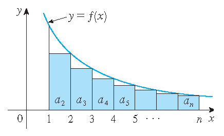
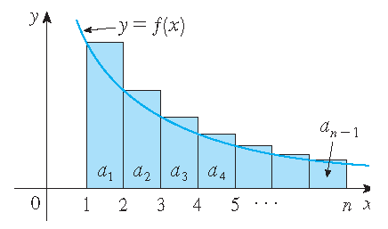
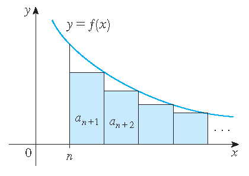
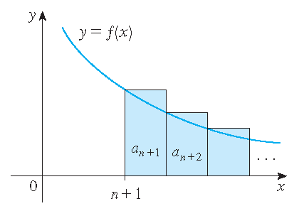

(Sec:Series:PositiveSeries)=
# Tests for positive series

## Introduction

In {numref}`Sec:Series:InfiniteSeries` we have talked about infinite series, wether they are convergent or divergent. We also introduced the concept of absolute convergence and conditional convergence. In this section we will give some tests to determine whether a series is convergent or divergent. These tests only work for series with *positive terms*, which we call **positive series**, or series that eventually only have positive terms.

(Sec:Series:PositiveSeries:IntegralTest)=
## The integral test

In {prf:ref}`Ex:Series:HarmonicSeries`, {prf:ref}`Ex:Series:AbsoluteConvergence1` and the proof of {prf:ref}`Thm:Series:pSeries` we investigate $p$-series, which are series of the form $\displaystyle\sum_{n=1}^{\infty}\frac{1}{n^p}$, where $p$ is a positive real number. In the two examples and the proof, we compared the series with the integral of an appropriate function.

This concept can be generalized to the **integral test**. {numref}`Fig:Series:IntegralTest` gives the idea behind the integral test: you either search for a function that always lies above the rectangles (for convergence) or a function that always lies below the rectangles (for divergence). In both cases, the function should be continuous, positive and non-increasing on $[1,\infty)$ and $a_n=f(n)$.

:::{figure-start}
:width: 100%
:name: Fig:Series:IntegralTest

The two cases for the integral test are illustrated in the two figures above. In both cases we have $a_n=f(n)$, where $f$ is a continuous, positive and non-increasing function on $[1,\infty)$. The rectangles represent the terms of the series $\displaystyle\sum a_n$ and the area under the graph of $f$ represents the integral $\displaystyle\int_1^nf(x)\,dx$.
:::

::::{grid} 2
:gutter: 5

:::{grid-item}

+++
(_a_) $\displaystyle a_2+a_3+a_4+\cdots+a_n\leq\int_1^nf(x)\,dx$.
:::

:::{grid-item}

+++ 
(_b_) $\displaystyle\int_1^nf(x)\,dx\leq a_1+a_2+a_3+\cdots+a_{n-1}$.
:::

::::

:::{figure-end}
:::

::::{todo}
Replace the two figures in {numref}`Fig:Series:IntegralTest` with applets.
::::

::::::{prf:Theorem} Integral test
:label: Thm:Series:IntegralTest
Suppose $f$ is a _continuous_, _positive_ and _non-increasing_ function on $[1,\infty)$, $\displaystyle\sum_{n=1}^{\infty} a_n$ is a _positive series_ and let $a_n=f(n)$. Then we have:

$$
\sum_{n=1}^{\infty}a_n\;\text{is convergent}\quad\Longleftrightarrow\quad\int_1^{\infty}f(x)\,dx\;\text{is convergent.}
$$

::::::

::::::{admonition} Proof of {prf:ref}`Thm:Series:IntegralTest`
:class: tudproof, dropdown
The proof follows the same idea as in {prf:ref}`Ex:Series:HarmonicSeries`, {prf:ref}`Ex:Series:AbsoluteConvergence1` and the proof of {prf:ref}`Thm:Series:pSeries`. For *convergence* we draw the rectangles to the *left* (below the graph of $f$) and for *divergence* we draw the rectangles to the *right* (above the graph of $f$), see {numref}`Fig:Series:IntegralTest`.

Let us start with the convergent case. If we draw the rectangles to the left, then we have, see {numref}`Fig:Series:IntegralTest`(a):

\begin{align*}
s_n &= \sum_{k=1}^na_k \\
&= a_1 + \sum_{k=2}^na_k \\
&= a_1 + \sum_{k=2}^n f(k) \\
&\leq a_1 + \sum_{k=2}^n\int_{k}^{k+1}f(x)\,dx \\
&= a_1 + \int_1^nf(x)\,dx.
\end{align*}

This follows from the fact that $a_n=f(n)$ and $f$ is non-increasing on $[1,\infty)$. Now, if $\displaystyle\int_1^{\infty}f(x)\,dx$ is convergent, then we have

$$
\int_{1}^{\infty}f(x)\,dx = \int_{1}^{n}f(x)\,dx + \int_{n}^{\infty}f(x)\,dx > \int_{1}^{n}f(x)\,dx,
$$

since $f$ is positive on $[1,\infty)$. Therefore, if $\displaystyle\int_1^{\infty}f(x)\,dx=M$, then

$$
s_n\leq a_1+\int_1^{\infty}f(x)\,dx\leq a_1+M.
$$

This means that $\{s_n\}$ is bounded above. Further we have

$$
s_{n+1}=s_n+a_{n+1} > s_n,
$$

since $a_{n+1}=f(n+1) > 0$. Thus, $\{s_n\}$ is a strictly increasing sequence that is bounded above. Hence, it is convergent by {prf:ref}`Thm:Sequences:MonotonicBounded`. This means by {prf:ref}`Thm:Series:ConvergenceSum` that $\displaystyle\sum_{n=1}^{\infty} a_n$ is convergent if $\displaystyle\int_1^{\infty}f(x)\,dx$ is convergent.

Now we prove the divergent case. If we draw the rectangles to the right, then we have, see {numref}`Fig:Series:IntegralTest`(b):

\begin{align*}
s_n &= \sum_{k=1}^na_k \\
&> \sum_{k=1}^{n-1}a_k \\
&\geq \int_1^nf(x)\,dx.
\end{align*}

If $\displaystyle\int_1^{\infty}f(x)\,dx$ is divergent, then

$$
\lim_{n\to\infty}\int_1^nf(x)\,dx=\infty
$$

since $f$ is positive on $[1,\infty)$. Because $s_{n}>\displaystyle\int_1^nf(x)\,dx$ for all $n$, we must have $\lim\limits_{n\to\infty}s_{n}=\infty$. So $\displaystyle\sum a_n$ diverges if $\displaystyle\int_1^{\infty}f(x)\,dx$ is divergent.

::::::

::::::{prf:remark}
In other words we have:

1) If $\displaystyle\int_1^{\infty}f(x)\,dx$ is convergent, then $\displaystyle\sum_{n=1}^{\infty}a_n$ is convergent.

2) If $\displaystyle\int_1^{\infty}f(x)\,dx$ is divergent, then $\displaystyle\sum_{n=1}^{\infty}a_n$ is divergent.

::::::

We apply the integral test in the following examples.

::::::{prf:Example}
:label: Ex:Series:IntegralTestExample1

Consider the series $\displaystyle\sum_{n=1}^{\infty}\frac{1}{n^2+1}$.

The function $f(x)=\displaystyle\frac{1}{x^2+1}$ is continuous, positive and non-increasing on $[1,\infty)$ and

$$
\int_1^{\infty}\frac{1}{x^2+1}\,dx=\arctan(x)\bigg|_1^{\infty}=\frac{1}{2}\pi-\frac{\pi}{4}=\frac{\pi}{4}.
$$ 

The integral $\displaystyle\int_1^{\infty}\frac{1}{x^2+1}\,dx$ is therefore convergent, which implies that the series $\displaystyle\sum_{n=1}^{\infty}\frac{1}{n^2+1}$ is convergent as well.

::::::

::::::{prf:remark}
:label: Rem:Series:IntegralTestExample1

It is not easy to find the sum of the series $\displaystyle\sum_{n=1}^{\infty}\frac{1}{n^2+1}$. Using more advanced methods, which are beyond the scope of this book, it can be shown that

$$
\sum_{n=1}^{\infty}\frac{1}{n^2+1}=-\frac{1}{2}+\frac{\pi}{2}\cdot\frac{e^{\pi}+e^{-\pi}}{e^{\pi}-e^{-\pi}}=-\frac{1}{2}+\frac{\pi}{2}\cdot\frac{e^{2\pi}+1}{e^{2\pi}-1}\approx1.07667.
$$

::::::

It is not necessary that the series starts at $1$ or that all terms of the series are positive, as long as the terms are _eventually_ positive. The conditions on the function $f$ can also be relaxed. This is given by the next theorem.

::::::{prf:Theorem} Integral test (generalised)
:label: Thm:Series:IntegralTestGeneralized

Let $\displaystyle\sum_{n=p}^{\infty} a_n$ be a series with terms $a_n\geq 0$ for $n\geq N$, where $N\geq p$ is some fixed integer. Suppose that $f$ is a continuous, positive and non-increasing function on $[F,\infty)$ such that $a_n=f(n)$ for all integers $n\geq F$ for some integer $F$. Then we have:

$$
\sum_{n=p}^{\infty}a_n\;\text{is convergent}\quad\Longleftrightarrow\quad\int_F^{\infty}f(x)\,dx\;\text{is convergent.}
$$

::::::

We omit a proof of this theorem. The idea is the same as for the integral test, but we have to be careful with the indices. Note that the conditions only need to hold for $n\geq N$, where $N$ is some fixed integer.

We apply this generalised integral test in the following example.

::::::{prf:Example}
:label: Ex:Series:IntegralTestExample2

Consider the series $\displaystyle\sum_{n=2}^{\infty}\frac{\ln(n)}{n}$. This series has starting index $2$, so $p=2$ in the theorem.

Because $\ln(n)>0$ for $n>1$, the terms of the series are positive for $n\geq2$. This indicates that $N=p=2$ in the theorem.

Now take $f(x)=\displaystyle\frac{\ln(x)}{x}$, which is continuous for $x>0$ and it is positive for $x>1$. The derivative of $f$ is given by

$$
f'(x) = \frac{d}{dx}\left[\frac{\ln(x)}{x}\right] = \frac{\frac{1}{x}\cdot x - \ln(x)\cdot 1}{x^2} = \frac{1-\ln(x)}{x^2}.
$$

This derivative is non-positive for $x\geq e\approx 2.718$, which means $f$ is non-increasing for $x\geq e$. Since $N=p=2 < e < 3$, we can apply the integral test with $F=3$ in the theorem. We have

$$
\int_{3}^\infty\frac{\ln(x)}{x}\,dx=\int_{3}^\infty\ln(x)\,d(\ln(x))=\frac{1}{2}\ln^2(x)\bigg|_3^{\infty}=\infty.
$$

This implies that the series $\displaystyle\sum_{n=2}^{\infty}\frac{\ln(n)}{n}$ is divergent.

::::::

The generalised integral test can be used to find an estimation of the sum of a convergent series that satisfies the generalised integral test.

:::{figure-start}
:width: 100%
:name: Fig:Series:IntegralTestEstimatingSum

The two cases for estimating the sum of a series using the integral test are illustrated in the above two figures. In both cases we have $a_n=f(n)$ for $n\geq F$, where $f$ is a continuous, positive and non-increasing function on $[F,\infty)$.
:::

::::{grid} 2
:gutter: 5

:::{grid-item}

+++
(_a_) $R_F\leq\displaystyle\int_F^{\infty}f(x)\,dx$.
:::

:::{grid-item}

+++ 
(_b_) $\displaystyle\int_{F+1}^{\infty}f(x)\,dx\leq R_F$.
:::

::::

:::{figure-end}
:::

::::{todo}
Replace the two figures in {numref}`Fig:Series:IntegralTestEstimatingSum` with applets.
::::

::::::{prf:Theorem}
:label: Thm:Series:IntegralTestEstimatingSum

Let $\displaystyle\sum_{n=p}^{\infty} a_n$ be a series with terms $a_n\geq 0$ for $n\geq N$, where $N\geq p$ is some fixed integer. Suppose that $f$ is a continuous, positive and non-increasing function on $[F,\infty)$ such that $a_n=f(n)$ for all integers $n\geq F$ for some integer $F$.

Finally, assume that $\displaystyle\sum_{n=p}^{\infty}a_n$ is convergent with sum $s$ and let $s_M=\displaystyle\sum_{n=p}^M a_n$ be the $M$th partial sum with $M\geq F$ and define the **remainder** $R_M=s-s_M$. Then

$$
\int_{M+1}^{\infty}f(x)\,dx\leq R_M\leq\int_F^{\infty}f(x)\,dx.
$$

::::::

::::::{admonition} Proof of {prf:ref}`Thm:Series:IntegralTestEstimatingSum`
:class: tudproof, dropdown
Note that

$$
R_M=s-s_M=a_{M+1}+a_{M+2}+a_{M+3}+\cdots
$$

is the **remainder**, so the error made when the $M$th partial sum $s_M$ is used as an approximation of the sum $s$.

We use the same idea as for the integral test, assuming that $f$ is non-increasing on $[M,\infty)\subseteq[F,\infty)$. Comparing the areas of the rectangles with the area under the graph of $f$ on $[F,\infty)$, we obtain

$$
R_M=a_{M+1}+a_{M+2}+a_{M+3}+\cdots\leq\int_M^{\infty}f(x)\,dx
$$

and

$$
R_M=a_{M+1}+a_{M+2}+a_{M+3}+\cdots\geq\int_{M+1}^{\infty}f(x)\,dx.
$$

This proves the theorem.
::::::

Using {prf:ref}`Thm:Series:IntegralTestEstimatingSum` we can find a range for the sum of a convergent series. The true value of the sum lies somewhere between the two bounds given by the integrals. In most cases we would like to have a better approximation of the sum than just the $M$th partial sum $s_M$. The next corollary gives an improved estimation of the sum of a convergent series that satisfies the generalised integral test.

::::::{prf:Corollary}
:label: Thm:Series:IntegralTestImprovedEstimation

Assume all conditions of {prf:ref}`Thm:Series:IntegralTestEstimatingSum` hold.

Let $T_M=\displaystyle\int_M^{\infty}f(x)\,dx$ and 

$$
s^* = s_M+\frac{T_M+T_{M+1}}{2}.
$$

Then the error $|s-s^*|$ satisfies

$$
|s-s^*|\leq\frac{T_M-T_{M+1}}{2}.
$$
::::::

::::::{prf:Example}
Consider $\displaystyle\sum_{n=1}^{\infty}\frac{1}{n^2+1}$ and let $s$ denote its sum. Note from {prf:ref}`Ex:Series:IntegralTestExample1` that the function $f(x)=\displaystyle\frac{1}{x^2+1}$ satisfies the conditions of the generalised integral test and we have $p=N=F=1$ in the theorems.

Let's take $M=10$ and use $s_{10}$ as an approximation of $s\approx1.07667$ (see {prf:ref}`Rem:Series:IntegralTestExample1`). We find:

\begin{align*}
s_{10}=\sum_{n=1}^{10}\frac{1}{n^2+1}&=\frac{1}{2}+\frac{1}{5}+\frac{1}{10}+\frac{1}{17}+\frac{1}{26}+\frac{1}{37}+\frac{1}{50}\\
&{}\quad\quad{}+\frac{1}{65}+\frac{1}{82}+\frac{1}{101} \\
&= \frac{1662222227}{1693047850} \\
&\approx 0.98179.
\end{align*}

How good is this approximation? Let

$$
T_M=\int_M^{\infty}\frac{dx}{x^2+1}=\arctan(x)\bigg|_M^{\infty}=\frac{1}{2}\pi-\arctan(M).
$$

Then, by {prf:ref}`Thm:Series:IntegralTestEstimatingSum`, for $R_M=s-s_M$ we have

$$
T_{M+1}\leq R_M\leq T_M.
$$

For $M=10$ we obtain $T_11=\displaystyle\int_{11}^{\infty}\frac{dx}{x^2+1}=\dfrac12\pi-\arctan(11)\approx0.09066$ and $T_{10}=\displaystyle\int_{10}^{\infty}\frac{dx}{x^2+1}=\dfrac12\pi-\arctan(10)\approx0.09967$. Hence, we have

$$
0.09066 \lesssim R_{10}\lesssim  0.09967.
$$

Since $s=s_{10}+R_{10}$ and $s_{10}\approx 0.98179$, this implies that

$$
0.98179+0.09066\lesssim s\lesssim 0.98179+0.09967
$$

or

$$
1.07245\lesssim s\lesssim 1.08146.
$$

Finally, we have

$$
\frac{T_{10}+T_{11}}{2}\approx\frac{0.09967+0.09066}{2}\approx0.09516
$$

and therefore

$$
s^*=s_{10}+\frac{T_{10}+T_{11}}{2}\approx0.98179+0.09516\approx1.07695.
$$

::::::

## Direct comparison tests

Instead of comparing series with integrals, we can also compare series with other series for which it is easier to determine whether they are convergent or divergent.

For example, the $p$-series, see {numref}`Sec:Series:pSeries`, will often be used in in such comparisons in order to determine whether a more difficult series is convergent or divergent.

We start with an example to illustrate the idea of direct comparison tests.

::::{prf:example}
:label: Ex:Series:DirectComparisonTest1

Consider the series $\displaystyle\sum_{n=1}^{\infty}\frac{1}{n^2+1}$. Because $n^2+1>n^2$ for all $n\geq1$, we have

$$
0<\frac{1}{n^2+1}<\frac{1}{n^2}
$$

for all $n\geq1$. This means that every term in the series $\displaystyle\sum_{n=1}^{\infty}\frac{1}{n^2+1}$ is smaller than the corresponding term in the $p$-series (with $p=2$) $\displaystyle\sum_{n=1}^{\infty}\frac{1}{n^2}$.

Hence, if $s_N$ is the $N$th partial sum of $\displaystyle\sum_{n=1}^{\infty}\frac{1}{n^2+1}$ and $t_N$ is the $N$th partial sum of $\displaystyle\sum_{n=1}^{\infty}\frac{1}{n^2}$, then we have $s_N<t_N$ for all $N$. Note that we also have $s_N>0$ for all $N$ since the terms of the series are positive.

Using the squeeze theorem for limits at infinity, see {prf:ref}`Theorem:LimitAtInfinity:Squeezetheorem`, we have

$$
0 < \lim_{N\to\infty}s_N \leq \lim_{N\to\infty}t_N.
$$

Hence, the series $\displaystyle\sum_{n=1}^{\infty}\frac{1}{n^2+1}$ is smaller than the series $\displaystyle\sum_{n=1}^{\infty}\frac{1}{n^2}$ _provided_ the latter is convergent. Since $\displaystyle\sum_{n=1}^{\infty}\frac{1}{n^2}$ is a $p$-series with $p=2>1$, which is convergent, we conclude that $\displaystyle\sum_{n=1}^{\infty}\frac{1}{n^2+1}$ is convergent as well.

::::

This concept of comparing two series with each other can be used to determine whether a series is convergent or divergent and is generalised in the following theorem. Note that we did have to use that the terms of the series are positive in order to apply the squeeze theorem for limits at infinity. This is why the direct comparison test only works for positive series.

::::::{prf:Theorem} Direct comparison tests
:label: Thm:Series:DirectComparisonTest
Suppose that $\displaystyle\sum_{n=1}^{\infty} a_n$ and $\displaystyle\sum_{n=1}^{\infty} b_n$ are series with $a_n>0$ and $b_n>0$ for all $n\geq 1$. Then we have:

If $a_n\leq b_n$ for all $n\geq 1$ and $\displaystyle\sum_{n=1}^{\infty} b_n$ is convergent, then $\displaystyle\sum_{n=1}^{\infty} a_n$ is also convergent.

If $a_n\geq b_n$ for all $n\geq 1$ and $\displaystyle\sum_{n=1}^{\infty} b_n$ is divergent, then $\displaystyle\sum_{n=1}^{\infty} a_n$ is also divergent.
::::::

::::::{admonition} Proof of {prf:ref}`Thm:Series:DirectComparisonTest`
:class: tudproof, dropdown
We define $s_n$ and $t_n$ as the $n$th partial sums of $\displaystyle\sum_{n=1}^{\infty} a_n$ and $\displaystyle\sum_{n=1}^{\infty} b_n$, respectively:

\begin{align*}
s_n &=\sum_{k=1}^n a_k, \\
t_n &= \sum_{k=1}^n b_k.
\end{align*}

_We first prove the convergent case._ Assume that $0<a_n\leq b_n$ for all $n\geq 1$ and $\displaystyle\sum_{n=1}^{\infty} b_n$ is convergent with sum $t$. Since $\displaystyle\sum_{n=1}^{\infty} b_n$ is convergent with sum $t$, the limit $\lim\limits_{n\to\infty}t_n=t$ exists.

Because $b_n>0$ for all $n\geq 1$, we have $t_{n+1}=t_n+b_{n+1}>t_n $ for all $n\geq 1$,. which makes $\{t_n\}$ a strictly increasing sequence. Since $\{t_n\}$ is a strictly increasing sequence that converges to $t$, it is bounded above by $t$. Hence, we have $t_n<t$ for all $n\geq 1$.

For the partial sum $s_n$ we have

$$
s_n = \sum_{k=1}^n a_k \leq \sum_{k=1}^n b_k = t_n.
$$

As a consequence, we have $s_n<t$ for all $n\geq 1$. $\{s_n\}$ is also a strictly increasing sequence since $a_n>0$ for all $n\geq 1$ and $s_{n+1}=s_n+a_{n+1}>s_n$ for all $n\geq 1$.

Since $\{s_n\}$ is a strictly increasing sequence that is bounded above by $t$, it is convergent by {prf:ref}`Thm:Sequences:MonotonicBounded` with $\lim\limits_{n\to\infty}s_n=s<t$ for some number $s$. Hence, $\displaystyle\sum_{n=1}^{\infty} a_n$ is convergent.

_Now we prove the divergent case._ Assume that $a_n\geq b_n>0$ for all $n\geq 1$ and $\displaystyle\sum_{n=1}^{\infty} b_n$ is divergent. This indicates that for every number $M>0$ there exists an integer $N$ such that $t_N>M$. Since $a_n\geq b_n$ for all $n\geq 1$, we have

$$
s_N = \sum_{k=1}^N a_k \geq \sum_{k=1}^N b_k = t_N > M.
$$

This means that for every number $M>0$ there exists an integer $N$ such that $s_N>M$. Hence, $\lim\limits_{n\to\infty}s_n=\infty$, which makes $\displaystyle\sum_{n=1}^{\infty} a_n$ a divergent series.

::::::

The series in {prf:ref}`Thm:Series:DirectComparisonTest` have starting index $1$, but this can be relaxed as well. As long as both series satisfy the next conditions, the direct comparison test can be applied:

- $a_n>0$ for all $n\geq N$ for some index $N$.
- $b_n>0$ for all $n\geq M$ for some index $M$.
- $a_n\leq b_n$ for all $n\geq C$ for some index $C\geq\max\{N,M\}$ for the convergent case.
- $a_n\geq b_n$ for all $n\geq D$ for some index $D\geq\max\{N,M\}$ for the divergent case.

::::::{prf:example}
:label: Ex:Series:DirectComparisonTest2

Consider the series $\displaystyle\sum_{n=1}^{\infty}\frac{\ln(n)}{n}$.

Because $\ln(n)>0$ for $n>1$, the terms of the series are positive for $n\geq2$.

For $n>e$ we have even $\ln(n)>1$, which implies that $\displaystyle\frac{\ln(n)}{n}>\frac{1}{n}$ for $n>e$. Since $e<3$, we have

$$
\frac{\ln(n)}{n}>\frac{1}{n}
$$

for all $n\geq3$.

$\displaystyle\sum_{n=1}^{\infty}\frac{1}{n}$ is a $p$-series with $p=1$, which is divergent by {prf:ref}`Thm:Series:pSeries`. So $\displaystyle\sum_{n=1}^{\infty}\frac{\ln(n)}{n}$ is divergent by the direct comparison test.

::::::

::::::{prf:example}
:label: Ex:Series:DirectComparisonTest3

Consider the series $\displaystyle\sum_{n=0}^{\infty}\frac{1}{2^n+1}$.

For $n\geq0$ we have $2^n+1>2^n$, which implies that

$$
\frac{1}{2^n+1}\leq\frac{1}{2^n}
$$

for all $n\geq0$.

$\displaystyle\sum_{n=0}^{\infty}\frac{1}{2^n}$ is a geometric series with common ratio $r=\dfrac{1}{2}$ which is convergent by {prf:ref}`Thm:Series:GeometricSeries`. This implies that $\displaystyle\sum_{n=0}^{\infty}\frac{1}{2^n+1}$ is convergent by the direct comparison test.
::::::

Sometimes the direct comparison test does not work. For example, consider the series $\displaystyle\sum_{n=1}^{\infty}\frac{1}{2^n-1}$. For $n\geq1$ we have $2^n-1<2^n$, which implies that

$$
\frac{1}{2^n-1}>\frac{1}{2^n}
$$

for all $n\geq1$. Since $\displaystyle\sum_{n=1}^{\infty}\frac{1}{2^n}$ is a geometric series with common ratio $r=\dfrac{1}{2}$ which is convergent by {prf:ref}`Thm:Series:GeometricSeries`, the direct comparison test does not work in this case. We need to use a different test to determine whether $\displaystyle\sum_{n=1}^{\infty}\frac{1}{2^n-1}$ is convergent or divergent, which we will do next.

## The limit comparison test

For large values of $n$ the fraction $\dfrac{1}{2^n-1}$ becomes very close to $\dfrac{1}{2^n}$, which you can see in {numref}`Fig:Series:LimitComparisonTest`. This suggests that $\displaystyle\sum_{n=1}^{\infty}\frac{1}{2^n-1}$ and $\displaystyle\sum_{n=1}^{\infty}\frac{1}{2^n}$ have the same behaviour, i.e. they are either both convergent or both divergent. The limit comparison test formalises this idea.

:::{figure} Images/Fig-Series-LimitComparisonTest.png
:class: dark-light
:width: 100%
:name: Fig:Series:LimitComparisonTest

The graph of $a_n=\dfrac{1}{2^n-1}$ and $b_n=\dfrac{1}{2^n}$.
:::

:::{todo}
Replace {numref}`Fig:Series:LimitComparisonTest` with an applet.
::: 

::::::{prf:Theorem} Limit comparison test
:label: Thm:Series:LimitComparisonTest
Suppose that $\displaystyle\sum a_n$ and $\displaystyle\sum b_n$ are series with *positive terms*. Let

If $\displaystyle\lim_{n\to\infty}\frac{a_n}{b_n}<\infty$ and $\displaystyle\sum b_n$ converges, then $\displaystyle\sum a_n$ also converges.

If $\displaystyle\lim_{n\to\infty}\frac{a_n}{b_n}>0$ and $\displaystyle\sum b_n$ diverges, then $\displaystyle\sum a_n$ also diverges.
::::::

::::::{admonition} Proof of {prf:ref}`Thm:Series:LimitComparisonTest`
:class: tudproof, dropdown

_We first prove the convergent case._ Assume that $\displaystyle\sum a_n$ and $\displaystyle\sum b_n$ are series with positive terms and $\lim_{n\to\infty}\frac{a_n}{b_n}=L<\infty$. This means that

$$
0<\frac{a_n}{b_n}<L+1
$$

for $n$ sufficiently large. Hence by the positivity of $a_n$ and $b_n$, we have $0<a_n<(L+1)b_n$ for $n$ sufficiently large. If $\displaystyle\sum b_n$ is convergent, then $\displaystyle\sum (L+1)b_n$ is also convergent since $L+1$ is just a constant. Hence, $\displaystyle\sum a_n$ is convergent by the direct comparison test.

_Now we prove the divergent case._ Assume that $\displaystyle\sum a_n$ and $\displaystyle\sum b_n$ are series with positive terms and $\lim_{n\to\infty}\frac{a_n}{b_n}=L>0$. This means that

$$
\frac{a_n}{b_n}>\frac{L}{2}
$$

for $n$ sufficiently large. Hence, we have $0<b_n<\dfrac{2}{L}a_n$ for $n$ sufficiently large. This implies that $\displaystyle\sum \dfrac{2}{L}a_n$ diverges whenever $\displaystyle\sum b_n$ diverges by the direct comparison test. Since $\displaystyle\sum \dfrac{2}{L}a_n$ is just a constant multiple of $\displaystyle\sum a_n$, we conclude that $\displaystyle\sum a_n$ also diverges by the direct comparison test.

::::::

:::{note}
The limit comparison test can be applied to series with starting index different from $1$ as well, as long as the conditions of the test are satisfied for $n\geq N$ for some fixed integer $N$ and the terms of the series are positive for $n\geq N$.
:::

::::::{prf:example}
:label: Ex:Series:LimitComparisonTest1

Consider the two series $\displaystyle\sum_{n=1}^{\infty}\frac{1}{2^n-1}$ and $\displaystyle\sum_{n=1}^{\infty}\frac{1}{2^n}$ from the end of the previous subsection. Let $a_n=\dfrac{1}{2^n-1}$ and $b_n=\dfrac{1}{2^n}$, then

$$
\lim_{n\to\infty}\frac{a_n}{b_n}=\lim_{n\to\infty}\frac{\dfrac{1}{2^n-1}}{\dfrac{1}{2^n}}=\lim_{n\to\infty}\frac{2^n}{2^n-1}=\lim_{n\to\infty}\frac{1}{1-\dfrac{1}{2^n}}=\frac{1}{1-0}=1.
$$

Since $\displaystyle\sum_{n=1}^{\infty}\frac{1}{2^n}$ converges (geometric series with common ratio $\frac{1}{2}$), we conclude that $\displaystyle\sum_{n=1}^{\infty}\frac{1}{2^n-1}$ converges too, as we expected from the graph in {numref}`Fig:Series:LimitComparisonTest`.

::::::

::::::{prf:example}
:label: Ex:Series:LimitComparisonTest2

Consider $\displaystyle\sum_{n=1}^{\infty}\frac{1}{1+\sqrt{n}}$. Let $a_n=\dfrac{1}{1+\sqrt{n}}$ and $b_n=\dfrac{1}{\sqrt{n}}$, then

$$
\lim_{n\to\infty}\frac{a_n}{b_n}=\lim_{n\to\infty}\frac{\dfrac{1}{1+\sqrt{n}}}{\dfrac{1}{\sqrt{n}}}=\lim_{n\to\infty}\frac{\sqrt{n}}{1+\sqrt{n}}=\lim_{n\to\infty}\frac{1}{\dfrac{1}{\sqrt{n}}+1}=\frac{1}{0+1}=1.
$$

Since $\displaystyle\sum_{n=1}^{\infty}\frac{1}{\sqrt{n}}$ is divergent ($p$-series with $p=\frac{1}{2}\leq1$), we conclude that $\displaystyle\sum_{n=1}^{\infty}\frac{1}{1+\sqrt{n}}$ is also divergent.

This conclusion is also clear from the graph of the partial sums $\displaystyle\sum_{n=1}^n a_k$ and $\displaystyle\sum_{n=1}^n b_k$. For large values of $n$, the two graphs are very close to each other, which indicates that the two series have the same behaviour.

:::{figure} Images/Fig-Series-LimitComparisonTest2.png
:name: Fig:Series:LimitComparisonTest2

The graph of the partial sums $\displaystyle\sum_{n=1}^N a_k$ and $\displaystyle\sum_{n=1}^N b_k$ for $a_n=\dfrac{1}{1+\sqrt{n}}$ and $b_n=\dfrac{1}{\sqrt{n}}$.
:::

:::{todo}
Replace {numref}`Fig:Series:LimitComparisonTest2` with an applet showing both in the same plot.
:::

::::::

In most cases the series $\displaystyle\sum a_n$ is given, and we have to find a suitable series $\displaystyle\sum b_n$ to compare it with. If $a_n$ is a rational function of $n$ (i.e. a ratio of two polynomials in $n$), or is a root of a rational function, then it is often a good idea to compare it with a $p$-series $\displaystyle\sum \frac{1}{n^p}$ for some $p>0$. The value of $p$ in this case is determined by taking the highest power of $n$ in the numerator and the highest power of $n$ in the denominator.

The idea behind this, is that for (very) large values of $n$, the lower degree terms in $a_n$ will become negligible compared to the higher degree terms, so $a_n$ will behave like a (root of a) rational function of $n$ that only contains the highest degree terms in the numerator and denominator. This new function will then be a $p$-series, which we can use for the limit comparison test.

::::::{prf:example}
:label: Ex:Series:LimitComparisonTest3

Consider $\displaystyle\sum_{n=1}^{\infty}\frac{2n+3}{n^3-2n+5}$. Let $a_n=\dfrac{2n+3}{n^3-2n+5}$, which is a rational function of $n$, then for (very) large $n$ we have $a_n\approx\dfrac{2n}{n^3}=\dfrac{2}{n^2}$.

So, let $b_n=\dfrac{1}{n^2}$, then

\begin{align*}
\lim_{n\to\infty}\frac{a_n}{b_n} &= \lim_{n\to\infty}\frac{\dfrac{2n+3}{n^3-2n+5}}{\dfrac{1}{n^2}} \\
&= \lim_{n\to\infty}\frac{(2n+3)n^2}{n^3-2n+5}\\
&= \lim_{n\to\infty}\frac{2+\dfrac{3}{n}}{1-\dfrac{2}{n^2}+\dfrac{5}{n^3}} \\
&= \frac{2+0}{1-0+0} \\
&= 2.
\end{align*}

Since $\displaystyle\sum_{n=1}^{\infty}\frac{1}{n^2}$ converges ($p$-series with $p=2>1$), we conclude that $\displaystyle\sum_{n=1}^{\infty}\frac{2n+3}{n^3-2n+5}$ converges as well.

::::::

::::::{prf:example}
:label: Ex:Series:LimitComparisonTest4

Consider $\displaystyle\sum_{n=0}^{\infty}\frac{\sqrt{n^4+4n+5}}{2n^5+3n^2+1}$. Let $a_n=\displaystyle\frac{\sqrt{n^4+4n+5}}{2n^5+3n^2+1}$.

In this case we have

$$
\left(a_n\right)^2 = \left(\frac{\sqrt{n^4+4n+5}}{2n^5+3n^2+1}\right)^2 = \frac{n^4+4n+5}{(2n^5+3n^2+1)^2} = \frac{n^4+4n+5}{4 n^10 + 12 n^7 + 4 n^5 + 9 n^4 + 6 n^2 + 1},
$$

which is a rational function in $n$, so $a_n$ is a root of a rational function in $n$.

Now take $b_n=\displaystyle\frac{\sqrt{n^4}}{n^5}=\frac{n^2}{n^5}=\frac{1}{n^3}$, then

\begin{align*}
\lim\limits_{n\to\infty}\frac{a_n}{b_n} &= \lim\limits_{n\to\infty}\frac{\sqrt{n^4+4n+5}}{2n^5+3n^2+1}\cdot\frac{n^3}{1} \\
&= \lim\limits_{n\to\infty}\frac{\sqrt{1+4n^{-3}+5n^{-4}}}{2+3n^{-3}+n^{-5}} \\
&= \frac{\sqrt{1+0+0}}{2+0+0} \\
&= \frac{1}{2}.
\end{align*}

Since $\displaystyle\sum_{n=1}^{\infty}b_n=\sum_{n=1}^{\infty}\frac{1}{n^3}$ is a $p$-series with $p=3>1$, which is convergent, we conclude that $\displaystyle\sum_{n=0}^{\infty}a_n=\sum_{n=0}^{\infty}\frac{\sqrt{n^4+4n+5}}{2n^5+3n^2+1}$ is convergent too.

::::::

::::::{prf:example}
:label: Ex:Series:LimitComparisonTest5

Consider $\displaystyle\sum_{n=0}^{\infty}\frac{3n^2+5n+2}{\sqrt{2n^5+4n^3+3}}$. Let $a_n=\displaystyle\frac{3n^2+5n+2}{\sqrt{2n^5+4n^3+3}}$ and $b_n=\displaystyle\frac{n^2}{\sqrt{n^5}}=\frac{n^2}{n^{\frac{5}{2}}}=\frac{1}{n^{\frac{1}{2}}}$, then

\begin{align*}
\lim\limits_{n\to\infty}\frac{a_n}{b_n} &= \lim\limits_{n\to\infty}\frac{3n^2+5n+2}{\sqrt{2n^5+4n^3+3}}\cdot\frac{n^{\frac{1}{2}}}{1} \\
&= \lim\limits_{n\to\infty}\frac{3+5n^{-1}+2n^{-2}}{\sqrt{2+4n^{-2}+3n^{-5}}} \\
&=\frac{3+0+0}{\sqrt{2+0+0}} \\
&= \frac{3}{\sqrt{2}}.
\end{align*}

Since $\displaystyle\sum_{n=1}^{\infty}b_n=\sum_{n=1}^{\infty}\frac{1}{n^{\frac{1}{2}}}$ is a $p$-series with $p=\displaystyle\frac{1}{2}\leq1$, which is divergent, we conclude that $\displaystyle\sum_{n=0}^{\infty}a_n=\sum_{n=0}^{\infty}\frac{3n^2+5n+2}{\sqrt{2n^5+4n^3+3}}$ is divergent too.

::::::

## Grasple exercises

:::{todo}
Add Grasple exercises for the integral test, direct comparison test and limit comparison test in {numref}`Sec:Series:PositiveSeries`.  
:::